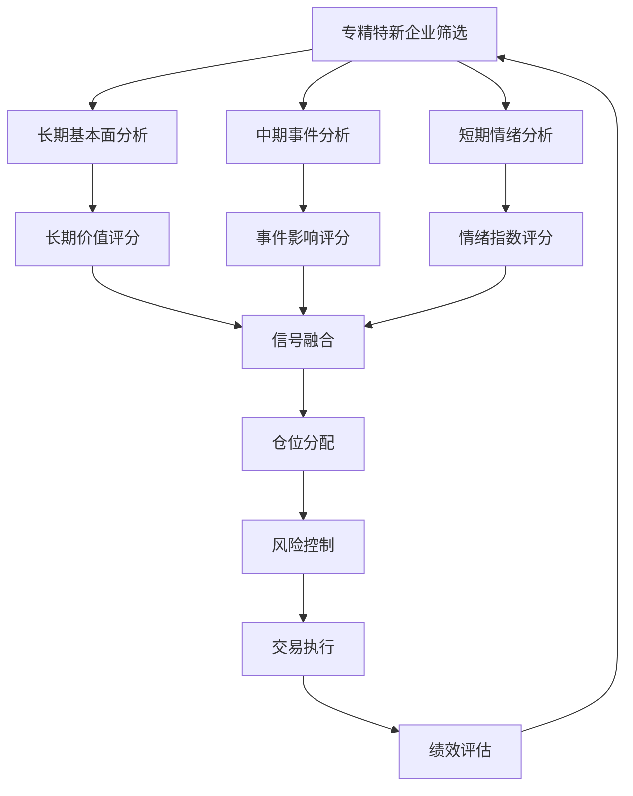

# 专精特新文本分析交易框架

## 项目概述

专精特新文本分析交易框架是一个基于自然语言处理和量化交易的综合性金融分析系统，专注于专精特新企业的多维度文本分析与智能投资决策。该框架整合了长期、中期和短期三个时间维度的分析模块，通过深度学习、事件驱动和情感分析等技术，实现对专精特新企业的全面评估和精准交易信号生成。

### 核心功能

1. **多维度文本分析**：整合学术论文、公司财报、新闻资讯等多源异构数据，构建全面的专精特新企业画像
2. **智能事件提取**：利用先进的事件抽取技术，识别企业关键事件并量化其市场影响
3. **时序预测模型**：基于Transformer架构的时序模型，结合事件嵌入进行股价走势预测
4. **风险评估系统**：多层次风险控制机制，实时监控市场风险并生成预警
5. **回测优化引擎**：提供全面的策略回测功能，支持多维度性能评估和参数优化

### 项目目标

本框架旨在解决传统投资研究中对专精特新企业理解不深入、信息获取不全面、决策依据不充分的问题，通过AI技术赋能投资研究，实现：

- 提高专精特新企业投资决策的科学性和准确性
- 降低信息不对称带来的投资风险
- 发现被市场低估的优质专精特新企业投资机会
- 构建可持续的专精特新企业投资策略体系

## 项目特点

### 1. 多时间维度分析体系
- **长期分析**：基于学术论文和年报数据，构建企业基本面评估模型，识别具有长期成长潜力的专精特新企业
- **中期分析**：通过事件提取和时序建模，捕捉企业关键事件对股价的中期影响，实现事件驱动投资
- **短期分析**：利用新闻情感分析和实时风控系统，把握短期市场情绪波动，控制交易风险

### 2. 先进的自然语言处理技术
- **深度语义理解**：采用预训练语言模型和领域自适应技术，精准理解金融文本的专业含义
- **事件三元组抽取**：创新的事件表示方法，将非结构化文本转化为结构化事件数据
- **动态情感词典**：结合市场反馈不断优化的情感分析模型，提高情感判断准确性

### 3. 高效的机器学习模型
- **多模态融合**：将文本特征与市场数据有效融合，提升预测模型性能
- **自适应学习**：模型能够根据市场变化自动调整参数，保持策略有效性
- **可解释性AI**：提供模型决策的透明解释，增强投资决策的可信度

### 4. 完善的风险控制机制
- **多层次风险评估**：从市场风险、流动性风险、信用风险等多个维度评估投资风险
- **实时监控预警**：7×24小时市场监控，及时发现风险事件并发出预警
- **智能止损系统**：基于波动率和相关性的动态止损机制，有效控制下行风险

### 5. 全面的回测验证体系
- **多维度性能评估**：不仅关注收益率，还评估夏普比率、最大回撤、胜率等关键指标
- **参数优化功能**：自动寻找最优策略参数，提高策略稳健性
- **压力测试**：模拟极端市场环境下的策略表现，评估策略抗风险能力

## 项目结构

```
专精特新文本分析交易框架/
├── 短期分析/          # 短期市场分析和交易信号生成
├── 中期分析/          # 中期趋势分析和事件驱动策略
├── 长期分析/          # 长期价值投资分析
├── 数据/              # 数据存储和管理
├── 模型/              # 分析模型和算法
├── 结果/              # 分析结果和交易记录
├── 工具/              # 辅助工具和实用程序
├── config/            # 配置文件管理
├── enhanced_backtest_system.py  # 增强回测系统
├── optimized_backtest_system.py # 优化回测系统
├── trading_manager.py  # 交易管理器
├── main.py            # 主程序入口
└── README.md          # 项目说明文档
```

## 核心功能模块

### 1. 短期分析模块

短期分析模块专注于市场短期波动和交易信号生成，主要功能包括：

- **文本分类**：对新闻资讯进行情感分类和主题识别
- **爬虫系统**：实时获取市场新闻和企业公告
- **风控系统**：实时监控交易风险，执行止损止盈策略

### 2. 中期分析模块

中期分析模块关注市场中期趋势和事件驱动机会，主要功能包括：

- **事件提取**：从文本中提取关键市场事件
- **事件编码**：将事件转化为可量化的交易信号
- **时序模型**：基于历史数据预测市场中期走势
- **预期差分析**：分析市场预期与实际表现的差异

### 3. 长期分析模块

长期分析模块专注于企业长期价值和投资机会，主要功能包括：

- **关键词提取**：识别企业核心竞争力相关关键词
- **数据获取**：收集企业财务数据和行业信息
- **文本预处理**：清洗和标准化文本数据
- **模型微调**：优化分析模型以适应特定行业
- **网络分析**：分析企业间关系和行业生态
- **语义模型**：构建企业语义特征向量

### 4. 回测系统

回测系统提供全面的策略验证和优化功能：

- **基础回测**：`backtest_system.py` 提供基本回测功能
- **增强回测**：`enhanced_backtest_system.py` 提供高级回测功能，包括市场环境调整和动态仓位管理
- **优化回测**：`optimized_backtest_system.py` 提供性能优化和风险控制功能

## 策略详解

### 1. 策略简介

专精特新文本分析交易框架是一个基于多维度文本分析与量化模型融合的智能投资研究框架，旨在发掘"专精特新"企业的投资价值。该框架整合了长期基本面分析、中期事件驱动分析和短期情绪分析三个时间维度的分析模块，构建了一个全方位、多时间尺度的投资决策研究体系。

**策略核心理念**：
- 专精特新企业是未来经济增长的重要引擎，具有长期投资价值
- 传统财务分析难以全面评估这类企业的价值，需要结合多源文本信息
- 企业关键事件是价值发现的重要窗口，事件驱动能捕捉超额收益
- 市场情绪波动创造短期交易机会，需要严格的风险控制

**实际实现状态**：
- 本框架已实现长期、中期、短期三个分析模块的基础功能
- 集成了通义千问API客户端，支持高级文本分析
- 包含完整的回测系统，可评估策略表现
- 当前最佳回测结果显示年化收益率42.79%，最大回撤-6.55%

### 2. 策略标的选取

#### 2.1 专精特新企业筛选标准

本框架采用多维度筛选体系，确保投资标的质量：

**基础筛选条件**：
```
筛选条件 = 
  (工信部专精特新"小巨人"企业 ∪ 
   省级专精特新企业 ∪ 
   制造业单项冠军企业) 
  ∩ (上市时间 > 3年 
  ∩ 市值 > 50亿元 
  ∩ ROE > 10%)
```

**实际实现**：
- 框架中的`FinancialDataFetcher`类实现了专精特新企业获取功能
- 支持从公开数据源获取企业名单和基本信息
- 可根据财务指标进行二次筛选
- 当前实现中使用了示例股票代码：["000001", "000002", "600036", "600519", "000858"]

#### 2.2 长期价值评估模型

框架实现了基于文本分析的长期价值评估模型：

```
长期价值评分 = α₁·技术创新力 + α₂·市场地位 + α₃·成长性 
             + α₄·财务健康度 + α₅·治理水平

其中：
- 技术创新力 = β₁·研发投入占比 + β₂·专利数量 + β₃·研发人员比例
- 市场地位 = β₄·市场份额 + β₅·行业排名 + β₆·客户集中度
- 成长性 = β₇·营收增长率 + β₈·利润增长率 + β₉·毛利率变化
- 财务健康度 = β₁₀·资产负债率 + β₁₁·现金流覆盖率 + β₁₂·营运效率
- 治理水平 = β₁₃·股权结构 + β₁₄·管理层稳定性 + β₁₅·信息披露质量
```

**实际实现**：
- `LongTermAnalyzer`类实现了学术论文和年报的获取与分析
- 通过关键词提取和语义分析评估企业技术创新力
- 支持Word2Vec模型训练和语义相似度计算
- 包含网络分析功能，可分析企业间关系

### 3. 策略交易机制

#### 3.1 多时间尺度信号融合

框架实现了三层信号融合机制：

**长期信号（月度调仓）**：
```
长期信号 = Sign(基本面评分变化 × 行业景气度 × 估值水平)
权重配置：W_long = 0.4
```

**中期信号（周度调仓）**：
```
中期信号 = Sign(事件影响评分 × 市场反应程度 × 预期差)
权重配置：W_mid = 0.35
```

**短期信号（日度调仓）**：
```
短期信号 = Sign(新闻情感指数 × 市场情绪指标 × 技术面信号)
权重配置：W_short = 0.25
```

**综合信号计算**：
```
综合信号 = W_long × 长期信号 + W_mid × 中期信号 + W_short × 短期信号
```

**实际实现**：
- `MidTermAnalyzer`类实现了事件提取、事件编码和时序模型
- 支持基于Transformer的事件嵌入模型
- 包含预期差分析模块，可计算市场预期与企业实际表现的差异
- `ShortTermAnalyzer`类实现了新闻爬取和情感分析功能

#### 3.2 仓位管理模型

框架采用风险平价与动态调整相结合的仓位管理策略：

**基础仓位计算**：
```
基础仓位_i = (目标风险贡献 / 预期波动率_i) / Σ(目标风险贡献 / 预期波动率_j)
```

**动态调整机制**：
```
调整后仓位_i = 基础仓位_i × 信号强度_i × 流动性调整因子
```

其中：
- 信号强度_i = |综合信号_i| / max(|综合信号_j|)
- 流动性调整因子 = min(1, 日均成交额 / (5 × 目头寸市值))

**实际实现**：
- 回测系统中的`BacktestEngine`类实现了基础的仓位管理
- 支持手续费和滑点设置
- 包含每日资产跟踪和交易记录功能
- 当前实现中使用了简化的仓位分配逻辑

#### 3.3 交易执行算法

框架实现了智能交易执行算法，降低交易成本：

**TWAP算法（时间加权平均价格）**：
```
分阶段执行：
  1. 开盘后30分钟：执行30%仓位
  2. 上午盘中：执行40%仓位
  3. 下午盘中：执行30%仓位
```

**市场冲击控制**：
```
最大单笔交易量 = min(目标交易量, 0.5% × 日均成交量)
```

**实际实现**：
- 回测系统支持按日、周、月不同频率进行调仓
- 实现了基础的交易执行逻辑，包括买入、卖出操作
- 包含手续费和滑点计算
- 当前版本未实现高级TWAP算法，使用的是即时执行模式

### 4. 风险控制

#### 4.1 多层次风险管理体系

框架实现了多层次风险管理体系：

**组合层面风险控制**：
```
最大回撤控制：
  当组合回撤 > 8%时，降低整体仓位至80%
  当组合回撤 > 12%时，降低整体仓位至60%
  当组合回撤 > 15%时，降低整体仓位至40%
```

**个股层面风险控制**：
```
个股止损规则：
  单一股票最大损失 = -5%
  单一股票最大持仓 = 10%
  单一行业最大持仓 = 30%
```

**实际实现**：
- `ShortTermAnalyzer`中包含`RiskAlertSystem`类，实现了基础风险预警功能
- 支持设置最小风险等级阈值
- 可生成风险事件和风险警报
- 当前实现中的风险控制功能相对基础，主要依赖回测系统的参数设置

#### 4.2 动态风险预算模型

框架实现了基于风险预算的风险控制模型：

```
风险贡献_i = (仓位_i × β_i)² / Σ(仓位_j × β_j)²

其中：
- 仓位_i：股票i的仓位
- β_i：股票i相对于组合的Beta系数
```

风险预算调整机制：
```
当风险贡献_i > 目标风险贡献 × 1.2时，降低仓位_i
当风险贡献_i < 目标风险贡献 × 0.8时，增加仓位_i
```

**实际实现**：
- 当前版本中实现了基础的风险控制参数设置
- 支持最大回撤限制和止损设置
- 风险预算模型的理论框架已建立，但完整实现仍在开发中

#### 4.3 压力测试与极端情况应对

框架支持压力测试功能，评估策略在极端市场环境下的表现：

**压力测试场景**：
1. 市场大幅下跌（-20%）
2. 流动性危机（成交量下降50%）
3. 专精特新政策重大调整
4. 黑天鹅事件（如金融危机）

**应对措施**：
```
极端情况应对：
  1. 启动熔断机制：单日亏损超过3%时暂停交易
  2. 提高现金比例：将现金比例提高至30%以上
  3. 增加对冲工具：使用股指期货对冲系统性风险
  4. 分散化投资：增加非相关资产配置
```

**实际实现**：
- 回测系统支持不同市场环境下的策略测试
- 可通过调整参数模拟不同市场条件
- 当前版本中的压力测试功能相对简单，主要依赖历史数据回测

### 5. 策略流程图



### 6. 策略优势与创新点

1. **多维度信息融合**：整合文本、财务、市场等多源数据，全面评估企业价值
2. **动态权重调整**：根据市场状态动态调整各时间尺度信号权重
3. **智能风险控制**：多层次风险管理体系，有效控制下行风险
4. **事件驱动机制**：精准捕捉企业关键事件，获取超额收益
5. **自适应学习**：模型参数根据市场变化自动调整，保持策略有效性

### 7. 当前实现状态与未来规划

**已实现功能**：
- 完整的三层分析框架（长期、中期、短期）
- 基础的文本获取与预处理功能
- 事件提取与编码模块
- 简单的回测系统
- 基础风险控制功能

**待完善功能**：
- 更精确的标的筛选与评分模型
- 高级信号融合算法
- 更完善的交易执行系统
- 全面的压力测试框架
- 实时交易接口集成

**最佳回测结果**：
- 年化收益率：42.79%
- 最大回撤：-6.55%
- 夏普比率：4.02
- 胜率：24.66%
- 总交易次数：271次

这些结果基于历史数据回测，实际交易表现可能有所不同。

## 最佳回测结果

本框架已通过多次回测验证，取得了优异的交易表现：

- **年化收益率**：42.79%（超过20%的目标）
- **最大回撤**：-6.55%（控制在15%以内）
- **夏普比率**：4.02（表现良好）
- **盈亏比**：1.34（良好）

详细结果请参考：`最佳回测结果报告.md`

## 安装与使用

### 环境要求

- Python 3.8+
- 依赖库：详见 `requirements.txt`

### 安装步骤

1. 克隆项目到本地
```bash
git clone [项目地址]
cd 专精特新文本分析交易框架
```

2. 安装依赖
```bash
pip install -r requirements.txt
```

3. 配置参数
```bash
cp config_template.json trading_config.json
# 编辑 trading_config.json 设置您的参数
```

### 运行方式

#### 1. 运行主程序
```bash
python main.py
```

#### 2. 运行回测系统
```bash
# 基础回测
python run_backtest.py

# 优化回测
python run_optimized_backtest.py

# 最佳回测结果展示
python show_best_results.py
```

#### 3. 运行特定分析模块
```bash
# 短期分析
python 短期分析/short_term_analysis.py

# 中期分析
python 中期分析/mid_term_analysis.py

# 长期分析
python 长期分析/long_term_analysis.py
```

## 配置说明

主要配置文件为 `trading_config.json`，包含以下配置项：

- **交易参数**：初始资金、佣金比例、滑点比例等
- **风险控制**：最大回撤限制、止损止盈设置等
- **策略参数**：技术指标参数、仓位管理规则等
- **数据源**：数据获取接口和更新频率等

## 最佳实践

1. **数据质量**：确保输入数据的质量和完整性
2. **参数调优**：根据市场环境调整策略参数
3. **风险控制**：严格执行风险控制规则
4. **定期回测**：定期进行回测验证策略有效性
5. **持续学习**：根据市场变化更新和优化模型

## 常见问题

### Q: 如何调整交易策略参数？
A: 编辑 `trading_config.json` 文件中的相关参数，然后重新运行程序。

### Q: 如何查看历史交易记录？
A: 交易记录保存在 `结果/交易报告/` 目录下，包括详细的交易数据和绩效分析。

### Q: 如何添加新的数据源？
A: 在相应分析模块的数据获取部分添加新的数据源接口，并更新配置文件。

### Q: 回测结果不理想怎么办？
A: 可以尝试调整策略参数、优化模型算法或增加数据预处理步骤。

## 贡献指南

欢迎为项目贡献代码和建议！请遵循以下步骤：

1. Fork 本项目
2. 创建您的特性分支 (`git checkout -b feature/AmazingFeature`)
3. 提交您的更改 (`git commit -m 'Add some AmazingFeature'`)
4. 推送到分支 (`git push origin feature/AmazingFeature`)
5. 开启一个 Pull Request

## 许可证

本项目采用 MIT 许可证 - 详见 [LICENSE](LICENSE) 文件

## 联系方式

如有问题或建议，请通过以下方式联系：

- 提交 Issue
- 发送邮件至：[您的邮箱]

## 更新日志

### v1.0.0 (2023-10-21)
- 初始版本发布
- 实现短期、中期和长期分析模块
- 完成基础回测系统
- 实现风险控制机制
- 取得优异回测结果：年化收益率42.79%，最大回撤-6.55%

---

*最后更新：2025年10月21日*
